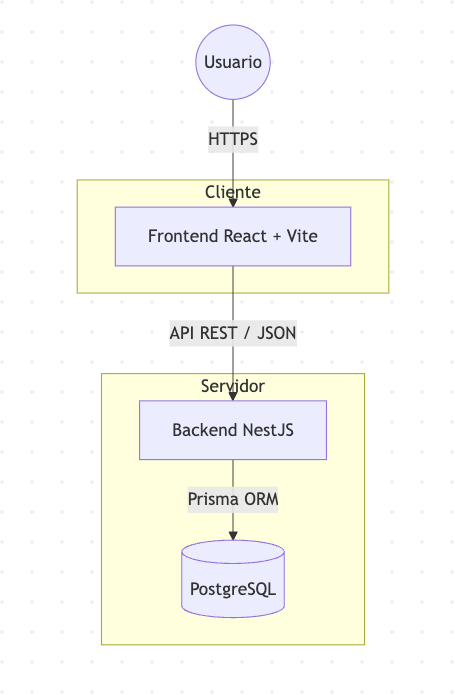
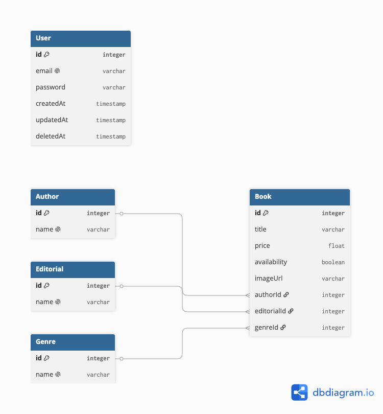

# CMPC Libros: Sistema de Gestión de Inventario

[cite_start]Esta aplicación es una solución Full Stack diseñada para digitalizar la gestión de inventario de una biblioteca, permitiendo el control total sobre los libros, autores, editoriales y géneros[cite: 404].

## Arquitectura del Sistema
El sistema sigue una arquitectura de tres capas:

1.  [cite_start]**Frontend**: Single Page Application desarrollada en **React** con **TypeScript** y **Vite**, utilizando estilos modulares y componentes funcionales[cite: 409].
2.  [cite_start]**Backend**: API RESTful construida con **NestJS**, utilizando **Prisma ORM** para la persistencia de datos[cite: 419, 428].
3.  [cite_start]**Base de Datos**: **PostgreSQL** para asegurar la integridad relacional de los datos[cite: 427].



## Instrucciones de Despliegue Local

[cite_start]Para desplegar el proyecto localmente, asegúrate de tener instalado **Docker** y **Docker Compose**[cite: 440].

1.  Clona el repositorio.
2. **Configuración de variables de entorno**:
   - Ve a la carpeta `backend/`.
   - Crea un archivo llamado `.env` copiando el contenido de `.env.example`.
   - Asegúrate de completar los valores necesarios en el nuevo archivo `.env` (especialmente `DATABASE_URL` y `JWT_SECRET`).
3.  Ejecuta el siguiente comando en la raíz del proyecto:
    ```bash
    docker-compose up --build
    ```
4.  El sistema levantará los servicios:
    * **Frontend**: `http://localhost:5173`
    * **Backend API**: `http://localhost:3000/api/v1`
    * [cite_start]**Documentación API (Swagger)**: `http://localhost:3000/api/v1/docs` [cite: 449]

## Decisiones Técnicas
* [cite_start]**Autenticación**: Implementada mediante **JWT** con guardias personalizadas para proteger las rutas de la API[cite: 421].
* [cite_start]**Gestión de datos**: Se optó por **Prisma ORM** por su tipado estricto y capacidad de generar migraciones automáticas, garantizando una base de datos normalizada[cite: 428, 429].
* [cite_start]**Soft Delete**: Implementado en el Backend para recuperar registros borrados accidentalmente[cite: 425].
* [cite_start]**Intercepción**: Se utilizan interceptores para estandarizar las respuestas de la API y realizar el logging de auditoría en tiempo real[cite: 426, 456].

## Modelo Relacional
[cite_start]El esquema de datos está normalizado con las siguientes entidades principales[cite: 430]:
* [cite_start]**Book**: Entidad central con relaciones hacia Autores, Editoriales y Géneros[cite: 432].
* [cite_start]**User**: Gestión de credenciales para el acceso al sistema[cite: 410].



## Guía de Uso
1.  [cite_start]**Login**: Utiliza tus credenciales para acceder al sistema[cite: 410].
2.  [cite_start]**Dashboard**: Podrás listar libros, filtrar por cualquier parámetro y ordenar los resultados[cite: 411, 413].
3.  [cite_start]**Gestión**: El botón de "Crear Libro" abre un formulario para registrar nuevas obras[cite: 416]. Cada libro puede ser editado o eliminado de forma segura.


## Roadmap y Consideraciones de Alcance

Debido a la restricción del tiempo propuesto (12-15 horas de dedicación total), se priorizó la funcionalidad crítica del backend y la robustez del CRUD de libros. Las siguientes funcionalidades fueron identificadas como necesarias para una versión de producción, pero quedaron fuera del alcance de esta entrega:

Testing Frontend: Se priorizó la cobertura de tests unitarios en el backend (alcanzando un >90%) para garantizar la integridad de los datos y la lógica de negocio. Para el frontend, se recomienda implementar una estrategia de testing con Vitest y React Testing Library en iteraciones futuras.

Gestión de Usuarios (Frontend): El backend cuenta con endpoints completos para la administración de usuarios (CRUD), sin embargo, la interfaz de administración para gestionar estos perfiles desde el frontend no fue implementada para concentrar el esfuerzo en el core de inventario de libros.

Paginación avanzada: Actualmente se implementó una paginación simple. Como mejora, se podría implementar Infinite Scroll para una mejor experiencia de usuario.